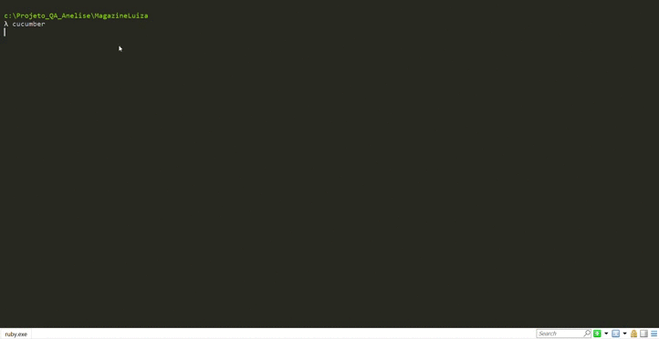

# Projeto_QA_Anelise

Criação de um teste automatizado com fluxo de ponta a ponta para o Desafio QA Jr Smarkio. Foi escolhido o site da loja Magazine Luiza para simular a escolha de um produto (Smart Tv) e sua validação no carrinho de compras em um cenário e seus fluxos alternativos. 


### 🛠️ Ferramentas Utilizadas

Visual Studio Code 1.54 
<br>Ruby 2.7
<br>Cmder 1.3
<br>Gems (Disponíveis em:  "https://rubygems.org")

gem "capybara", "3.35"
<br>gem "cucumber", "5.3"
<br>gem "selenium-webdriver", "3.142.7"
<br>gem "rspec", "3.10"
<br>gem "rufo", "0.12.0"            (Instale também a extensão 'rufo (Ruby formatter)' mbessey.vscode-rufo para identação automática)

A ferramenta Cucumber foi utilizada para executar o teste em formato BDD, escrito na liguagem Gherkin. 


WebDrivers: Incluir a localização em sue ambiente Path (versão compatível com o seu navegador):
```
Para Google Chrome -------  https://chromedriver.chromium.org/downloads
Para Mozilla Firefox -----  https://github.com/mozilla/geckodriver/releases
```


### 📦 Preparando o Ambiente

Clone o projeto do GitHub em um diretório:

```
cd "seu diretorio"
git clone https://github.com/Anelise91/Teste_QA_SMRK.git
```

E execute o seguinte comando para instalar as dependências do Gemfile

```
bundle install
```

## ⚙️ Executando os testes

Utilize o seguinte comando para executar todos os cenários de teste: 

```
cucumber
```
Visualização no console:

  
  
  
Visualização no browser:  

  

### 🔩 Cenários de Testes

Os quatro cenários apresentados foram:

```
Busca pelo produto com garantia estendida
Busca pelo produto no campo de pesquisa
Seleção do produto menu todos os departamentos
Seleção do produto posicionando sobre cabeçalho
```


## ✒️ Autora

<a href="https://www.linkedin.com/in/anelisemaia/">
 
  
 <sub><b>Anelise Maia</b></sub></a>

[](https://www.linkedin.com/in/anelisemaia/) 
[](mailto:anelisemaia@gmail.com)
